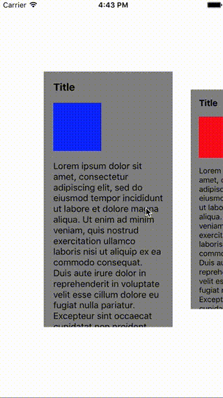

# ResizablePager

[]()
[](https://github.com/Carthage/Carthage)

ResizablePager is provide resizable views, and it will paging.

## Requirements

- Swift 3.0.2
- Xcode 8.2.1
- iOS 9.0 or later

## Image



## Installation

### Carthage

```bash
github "rb-de0/ResizablePager"
```

## Usage

```Swift
import UIKit
import ResizablePager

class ViewController: UIViewController {
    
    @IBOutlet private weak var pagerView: ResizablePagerView!
    
    fileprivate var contents: [UIColor] = [
        .blue,
        .red,
        .yellow,
        .green,
        .black
    ]

    override func viewDidLoad() {
        super.viewDidLoad()
        
        pagerView.resizeRate = 0.85
        pagerView.edgeMargin = 80
        pagerView.verticalMargin = 120
        pagerView.viewMargin = 30
        
        pagerView.delegate = self
        pagerView.dataSource = self
    }
}

// MARK: - ResizablePagerViewDataSource
extension ViewController: ResizablePagerViewDataSource {
    
    func numberOfItems() -> Int {
        return contents.count
    }
    
    func resizablePagerView(_ resizablePagerView: ResizablePagerView, viewForAtIndex index: Int) -> ResizableView {
        let view = UINib(nibName: "ContentView", bundle: nil).instantiate(withOwner: nil, options: nil).first as! ContentView
        view.configure(with: contents[index])
        view.backgroundColor = .gray
        return view
    }
}

// MARK: - ResizablePagerViewDelegate
extension ViewController: ResizablePagerViewDelegate {

    func resizablePagerView(_ resizablePagerView: ResizablePagerView, didSelectAt index: Int) {
        print(index)
    }
}
```

### ResizablePagerView

ResizablePagerView is a container view containing ScrollView. It can be instantiated from StoryBoard or from code.

#### Style Variables

- resizeRate ... The ratio of the size of the view that is centrally displayed to the size of the adjacent view.

- edgeMargin ... The horizontal margin between the rightmost and leftmost views and the parent view.

- verticalMargin ... The vertical margin between the view displayed in the center and the parent view.

- viewMargin ... The horizontal margin between the view displayed in the center and the adjacent view.

### ResizablePagerViewDataSource

ResizablePagerViewDataSource provides information on the actual content to be paged.

### ResizablePagerViewDelegate

ResizablePagerViewDelegate handles content interaction.

## Future Improvements

- Infinite Scroll
- Reuse Logic

## Author

[rb_de0](https://twitter.com/rb_de0), rebirth.de0@gmail.com

## License

ResizablePager is available under the MIT license. See the LICENSE file for more info.
